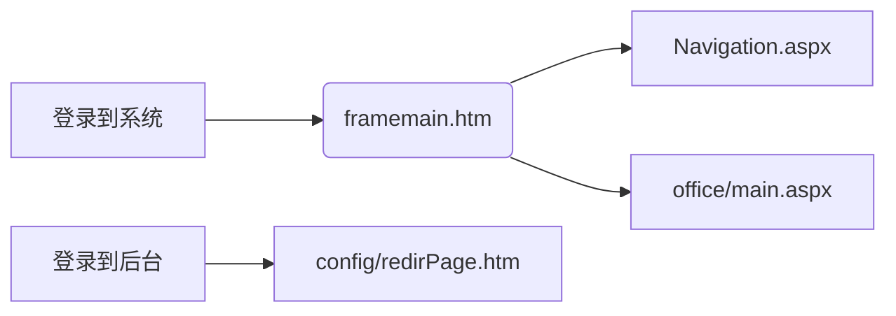
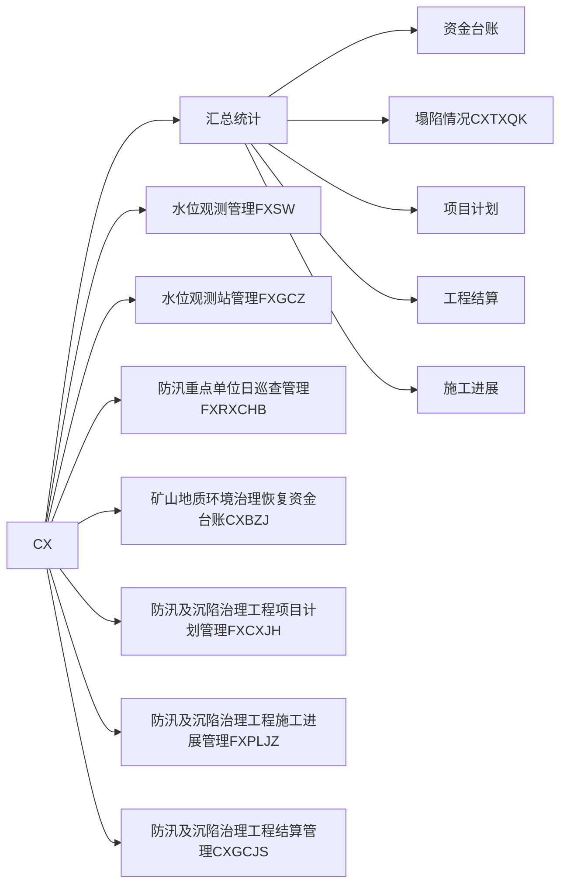
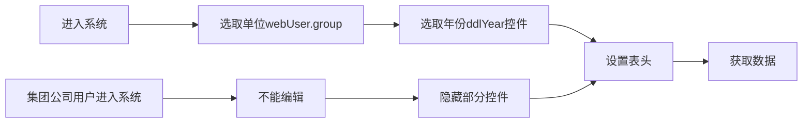

# 防汛及沉陷治理管理

## 原系统

原系统及其子系统主要包括**防汛日常巡查**、**水位观测**等**日常报表管理**，**矿山生态修复工程项目管理**等功能

## 升级系统

```python
'''
防汛基础资料管理
防汛工程管理
采煤塌陷区管理
矿山地质环境保护与土地复垦项目管理
矿山生态修复项目季报、年报管理
矿山地质环境治理恢复基金台账管理
数据接口与共享
手持智能终端辅助信息系统
'''
```

### 承担业务

采煤塌陷统计、沉陷治理计划的提交、治理合同管理、治理工程进展及明细管理、工程结算统计、防汛巡查管理、防汛除涝项目管理以及相关数据文件的上报、审批等工作

**数据的录入**由各二级单位填表人完成，并经单位负责人初步审核，提交至资源环境管理部进行最终统计审查


# 代码运行

## 重要函数

```html
<head runat="server">     表示这个页面是在服务器端运行，也就是可以在页面对应的.cs文件中使用
```


## 连接到数据库

在 **web.config**文件中配置数据库连接，代码写在<configuration></configuration>内

### 通过SQL数据库账号连接

```html
<appSettings>
    <add key="SuperAdmin" value="sa" />
    <add key="SuperPassword" value="sv" />
    <add key="connectionname" value="ConnectionString" />
    <add key="editableFileTypes" value=".txt .aspx .asp .htm .html" />
    <add key="imageFileTypes" value=".gif .jpg .jpeg .bmp .psd .tiff .tif .png" />
    <add key="musicFileTypes" value=".mp3 .mp2 .mp1 .wav .wma .cda .aif .aiff .au .snd" />
    <add key="mimedrawtype" value=".dwg .dgn .sas .mgt .txt .doc .xls .htm .gif .jpg .jpeg .bmp .psd .tiff .tif .png " />
</appSettings>
```

### 通过windows身份认证连接

```html
  <appSettings>
    <add key="connstring" value="Data Source=.;Initial Catalog=dataset;Integrated Security=True"/>
  </appSettings>
dataset为数据名
```


配置好之后，我们就可以在C#的后台文件中使用Connection对象连接

```C#
String constr = ConfigurationManager.AppSettings["connstring"].ToString();      //获取数据库的信息字符    
SqlConnection myconn = new SqlConnection(constr);
```

还有第二种写法，并不要在配置文件中配置

```C#
String constr = "Data Source=.;Initial Catalog=dataset;Integrated Security=True";
SqlConnection myconn = new SqlConnection(constr);
// 相关数据库的操作
myconn.open();
myconn.close();
```

## 操作数据库

提供了Command对象，用来对数据库进行增、删、改、查

```c#
// 查
String constr = "Data Source=.;Initial Catalog=dataset;Integrated Security=True";
SqlConnection myconn = new SqlConnection(constr);
myconn.Open();
// 查询的sql语句
string sql = "select * from custom ";
// new一个对象
SqlCommand cmd = new SqlCommand(sql, sqlConnection);
// 使用ExecuteReader（）来返回一个DataReader对象	
SqlDataReader dataReader = cmd.ExecuteReader();
// 将DataReader中的数据读取出来
Show.Text = "<tr><td>学号</td><td>姓名</td><td>学院</td><td>年龄</td><td>昵称</td></tr>";
while (dataReader.Read())
{
    Show.Text = Show.Text + "<tr><td>" + dataReader[0].ToString()
        + "</td><td>" + dataReader[1].ToString()
        + "</td><td>" + dataReader[2].ToString()
        + "</td><td>" + dataReader[3].ToString()
        + "</td><td>" + dataReader[4].ToString() + "</td></tr>";

}
sqlConnection.Close();

// add  use ExecuteNonQuery()
myconn.Open();
String sql = "insert into custom values('" + uid.Text + "','" + uname.Text + "','" + udepart.Text
    + "'," + uage.Text + ",'" + uename.Text + "','" + upassword.Text + "')";
SqlCommand cmd = new SqlCommand(sql, myconn);
if (cmd.ExecuteNonQuery() > 0)
{
    this.Response.Write("<script language='javascript'>alert('增加成功！')</script>");
}
else
{
    this.Response.Write("<script language='javascript'>alert('添加失败！')</script>");
}
myconn.Close();
```

## 用户名和密码

都是放在数据库中的，所以登录是通过与数据库中保存的用户名和密码来进行验证，成功就登录成功

在这一次的项目中是存放在dbo.Users这张表中

```sql
select *from dbo.Users
```

## sql数据库的登录

有两种登录方式：
	windows无需密码登录，在 **web.config**文件中配置即可
	使用sql数据库的用户名和密码登录：

```C#
<add name="ConnectionString" connectionString="Data Source=.;Initial Catalog=ZYHJMgrDataH;Persist Security Info=False;Max Pool Size=500;User ID=sa;password=123456" providerName="System.Data.SqlClient" />
这里的   User ID=sql数据库用户名，   password=密码
```

如果忘记自己的sql用户名和密码，可以先从windows无需密码处登录


双击打开，直接可以修改密码，然后点击**状态**，修改**登录启用**


# web.config配置

`<configuration>`
	属于根元素，其他节都在它内部

`<appSetting>`
	用于定义程序设置项，对一些不确定的设置，可以让用户自己设置

```xml
<appSettings>
    <add key="SuperAdmin" value="sa" />
    <add key="SuperPassword" value="sv" />
    <add key="connectionname" value="ConnectionString" />
    <add key="editableFileTypes" value=".txt .aspx .asp .htm .html" />
    <add key="imageFileTypes" value=".gif .jpg .jpeg .bmp .psd .tiff .tif .png" />
    <add key="musicFileTypes" value=".mp3 .mp2 .mp1 .wav .wma .cda .aif .aiff .au .snd" />
    <add key="mimedrawtype" value=".dwg .dgn .sas .mgt .txt .doc .xls .htm .gif .jpg .jpeg .bmp .psd .tiff .tif .png " />
  </appSettings>
```

```xml
<add key="" value="" server="" ;userid=sa;password=123456;database=Info;/>
这是定义一个连接字符串常量
<add key="" value="   .aspx"/>
这是定义一个错误重定的页面
```

`<compilation>`

```xml
<compilation debug="true" targetFramework="4.0"/>
其中还有 defaultLanguage="c#"  定义后台语言，可以选择  c#和VB.net
debug  为true时：启动aspx调试，一般在开发时设置为true，给客户时设置false
```

`<customErrors>`
	如果在执行期间，出现了未处理的错误，可以在此节配置相应的处理步骤，可以配置显示的html的错误页，避免错误堆栈追踪

```xml
<customErrors mode="Off" />
```

mode：具有On，Off，RemoteOnly三种状态
	On：始终显示自定义信息
	Off：始终显示详细的asp.net错误信息
	RemoteOnly：表示只对不在本地web服务器上运行的用户显示自定义的信息

defaultRedirect：用于出现错误时重新定向URL地址

statusCode：指明错误状态码，表明一种特定的错误状态

rredirect：错误重定向URL

（１）httpmodule    段： 定义了应用的http请求的处理模块以及诸如安全、日志之类的应用方式
（２）httphandlers 段： 负责映射URLs到IhttpHandler类
（３）sessionstat    段： 负责配置http模块的会话状态
（４）globalization   段：配置应用的公用设置
（５）compilation    段： 配置ASP.NET的编译环境
（６）trace　　　   段：配置ASP.NET的跟踪服务
（７）security         段：　ASP.NET的安全配置
（８）iisprocessmodel 段：　在IIS上配置ASP.NET的处理模式
（９）browercaps   段：　配置浏览器的兼容部件

| 元素Element        | 含义Purpose                                                  |
| ------------------ | ------------------------------------------------------------ |
| `<authentication>` | 指定所使用的客户身份验证模式Specify the client authentication mode to use |
| `<authorization>`  | 允许或者拒绝用户或角色的访问Allow or deny users or roles access |
| `<browserCaps>`    | 根据用户代理指定浏览器的能力Specify browser capabilities based on user agent |
| `<clientTarget>`   | 定义客户目标Define client targets                            |
| `<compilation>`    | 控制同页编译和程序集引用Control page compilation and assembly references |
| `<customErrors>`   | 控制错误页显示和定义自定义的错误页Control error page display and define custom error pages |
| `<globalization>`  | 设置请求和响应的编码Set the request and response encoding    |
| `<httpHandlers>`   | 添加或移除HTTP处理程序Add or remove HTTP handlers            |
| `<httpModules>`    | 添加或移除HTTP模块Add or remove HTTP modules                 |
| `<httpRuntime>`    | 控制HTTP请求的处理Control aspects of HTTP request processing |
| `<identity>`       | 为该应用程序指定标识Specify impersonation for this application |
| `<machineKey>`     | 控制验证和解密的钥匙Control the validation and decryption key |
| `<pages>`          | 设置全局的网页默认属性Set defaults for page attributes globally |
| `<processModel>`   | 控制工作者进程的行为方式Control the behavior of the worker process |
| `<securityPolicy>` | 使用相关的策略文件定义信任等级Define trust levels with associated policy files |
| `<sessionState>`   | 控制会话状态Control session state                            |
| `<trace>`          | 启用应用程序范围的跟踪Enable application-wide tracing        |
| `<trust>`          | 选择使用的信任等级Select which trust level to use            |
| `<webServices>`    | 指定Web服务的协议和范围Specify Web service protocols and extensions |
| `<appSettings>`    | 添加应用程序专用的数据元素Add application-specific data elements |

# VS基本知识

dll：动态链接库，Windows将一些主要的系统功能以DLL模块的形式实现，其中包含着能被程序或者其他DLL库调用来完成一定操作的方法


login.aspx.cs：



首先要添加**web控件**——**button按钮**，然后给其添加事件——**btnlogion_Click**，当然这个控件的所有的属性都可以在右下方的控件属性窗口修改（比如图片样式等）

```c#
protected void Page_Load(object sender, EventArgs e)
    {
        这也是一个web窗口事件 
    }
```


Naciqation.aspx:

```c#
IsPostBack // 防止页面多次加载
```

当点击提交按钮之后，浏览器会重新从服务器加载数据，原本的数据就无效，所以我们只需要**IsPostBack**的true值作为页面的第一次加载，客户端的隐藏控件**viewstate**将会保存客户端的数据，所以不需要重新加载

# CX项目




## **FXSW.aspx**


继承了`public class ExaminePage : MainBasePage`
	


```c#
//页面加载时发生
protected void Page_Load(object sender, EventArgs e){
    if (!IsPostBack)
        //仅仅存放了这个，所以页面正常加载的话不走这个代码体，所以暂时不研究
}
```

```c#
protected override void OnPreInit(EventArgs e){
    base.OnPreInit(e);
    //base是审批页面ExaminePage页面的基类，在页面初始化时会发生事件
    if (Request.QueryString["RID"] != null){
        // 获取地址栏参数（以GET方法提交的参数），也就是"RID"对应的参数值
    }
}
```

### 数据的绑定

`public override void BindData()`

数据绑定，直接指定**Datable**

`rgdList.Columns.FindByUniqueName("EditButtonColumn")`：表示在**控件rdgList**（也就是最大的那个）中**行（Colums）**中找到一个**控件的名字**（FindByUniqueName），这个控件的名字是**括号内**的内容，比如这个“EditButtonColumn”，表示的是**编辑**

`.Visible`表示在页面上是否可见，true表示可见

```c#
if (!webUser.HasSubDept()){
    这是自己命名的一个bool类型
}
```

```C#
//获取表头，并通过控件 ddlYear来获取年份，通过自定义来获取集团名字
    //          webUser.groupName == “淮南矿业集团”或者是别的，单位的名称
    rgdList.MasterTableView.Caption = string.Format("<p  style='font-size:18px;'>{0}  {1}年   地面主要水体水位观测表</p>", webUser.groupName, ddlYear.SelectedValue);
```

```c#
//执行sql server语句
//   webUser.group表示单位
    _sql = string.Format("select * from VFXSW where DeptNO={0} and Year(GCTime) = {1} order by GCZName, GCTime", webUser.group, ddlYear.SelectedValue);
```




**Datatable**

一、DataTable简介    

```c#
      //(1)构造函数 
      DataTable()   不带参数初始化DataTable 类的新实例。 
      DataTable(string tableName)  用指定的表名初始化DataTable 类的新实例。 
      DataTable(string tableName, string tableNamespace) 用指定的表名和命名空间初始化DataTable 类的新实例。 
      //(2) 常用属性 
      CaseSensitive    指示表中的字符串比较是否区分大小写。 
      ChildRelations   获取此DataTable 的子关系的集合。 
      Columns             获取属于该表的列的集合。 
      Constraints        获取由该表维护的约束的集合。 
      DataSet               获取此表所属的DataSet。 
      DefaultView       获取可能包括筛选视图或游标位置的表的自定义视图。 
      HasErrors          获取一个值，该值指示该表所属的DataSet 的任何表的任何行中是否有错误。 
      MinimumCapacity  获取或设置该表最初的起始大小。该表中行的最初起始大小。默认值为 50。 
      Rows                  获取属于该表的行的集合。 
      TableName       获取或设置DataTable 的名称。 

      //(3)常用方法 
      AcceptChanges()   提交自上次调用AcceptChanges() 以来对该表进行的所有更改。 
      BeginInit()         开始初始化在窗体上使用或由另一个组件使用的DataTable。初始化发生在运行时。

      Clear()               清除所有数据的DataTable。 
      Clone()              克隆DataTable 的结构，包括所有DataTable 架构和约束。 
      EndInit()            结束在窗体上使用或由另一个组件使用的DataTable 的初始化。初始化发生在运行时。 
      ImportRow(DataRow row)    将DataRow 复制到DataTable 中，保留任何属性设置以及初始值和当前值。 
      Merge(DataTable table)  将指定的DataTable 与当前的DataTable 合并。 
      NewRow()         创建与该表具有相同架构的新DataRow。
```


