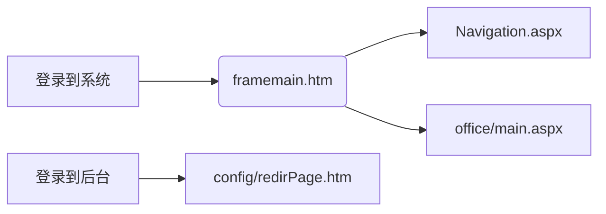

# 防汛及沉陷治理管理

## 原系统

原系统及其子系统主要包括**防汛日常巡查**、**水位观测**等**日常报表管理**，**矿山生态修复工程项目管理**等功能

## 升级系统

```python
'''
防汛基础资料管理
防汛工程管理
采煤塌陷区管理
矿山地质环境保护与土地复垦项目管理
矿山生态修复项目季报、年报管理
矿山地质环境治理恢复基金台账管理
数据接口与共享
手持智能终端辅助信息系统
'''
```

### 承担业务

采煤塌陷统计、沉陷治理计划的提交、治理合同管理、治理工程进展及明细管理、工程结算统计、防汛巡查管理、防汛除涝项目管理以及相关数据文件的上报、审批等工作

**数据的录入**由各二级单位填表人完成，并经单位负责人初步审核，提交至资源环境管理部进行最终统计审查


# 代码运行

## 重要函数

```html
<head runat="server">     表示这个页面是在服务器端运行，也就是可以在页面对应的.cs文件中使用
```


## 连接到数据库

在 **web.config**文件中配置数据库连接，代码写在<configuration></configuration>内

### 通过SQL数据库账号连接

```html
<appSettings>
    <add key="SuperAdmin" value="sa" />
    <add key="SuperPassword" value="sv" />
    <add key="connectionname" value="ConnectionString" />
    <add key="editableFileTypes" value=".txt .aspx .asp .htm .html" />
    <add key="imageFileTypes" value=".gif .jpg .jpeg .bmp .psd .tiff .tif .png" />
    <add key="musicFileTypes" value=".mp3 .mp2 .mp1 .wav .wma .cda .aif .aiff .au .snd" />
    <add key="mimedrawtype" value=".dwg .dgn .sas .mgt .txt .doc .xls .htm .gif .jpg .jpeg .bmp .psd .tiff .tif .png " />
</appSettings>
```

### 通过windows身份认证连接

```html
  <appSettings>
    <add key="connstring" value="Data Source=.;Initial Catalog=dataset;Integrated Security=True"/>
  </appSettings>
dataset为数据名
```


配置好之后，我们就可以在C#的后台文件中使用Connection对象连接

```C#
String constr = ConfigurationManager.AppSettings["connstring"].ToString();      //获取数据库的信息字符    
SqlConnection myconn = new SqlConnection(constr);
```

还有第二种写法，并不要在配置文件中配置

```C#
String constr = "Data Source=.;Initial Catalog=dataset;Integrated Security=True";
SqlConnection myconn = new SqlConnection(constr);
// 相关数据库的操作
myconn.open();
myconn.close();
```

## 操作数据库

提供了Command对象，用来对数据库进行增、删、改、查

```c#
// 查
String constr = "Data Source=.;Initial Catalog=dataset;Integrated Security=True";
SqlConnection myconn = new SqlConnection(constr);
myconn.Open();
// 查询的sql语句
string sql = "select * from custom ";
// new一个对象
SqlCommand cmd = new SqlCommand(sql, sqlConnection);
// 使用ExecuteReader（）来返回一个DataReader对象	
SqlDataReader dataReader = cmd.ExecuteReader();
// 将DataReader中的数据读取出来
Show.Text = "<tr><td>学号</td><td>姓名</td><td>学院</td><td>年龄</td><td>昵称</td></tr>";
while (dataReader.Read())
{
    Show.Text = Show.Text + "<tr><td>" + dataReader[0].ToString()
        + "</td><td>" + dataReader[1].ToString()
        + "</td><td>" + dataReader[2].ToString()
        + "</td><td>" + dataReader[3].ToString()
        + "</td><td>" + dataReader[4].ToString() + "</td></tr>";

}
sqlConnection.Close();

// add  use ExecuteNonQuery()
myconn.Open();
String sql = "insert into custom values('" + uid.Text + "','" + uname.Text + "','" + udepart.Text
    + "'," + uage.Text + ",'" + uename.Text + "','" + upassword.Text + "')";
SqlCommand cmd = new SqlCommand(sql, myconn);
if (cmd.ExecuteNonQuery() > 0)
{
    this.Response.Write("<script language='javascript'>alert('增加成功！')</script>");
}
else
{
    this.Response.Write("<script language='javascript'>alert('添加失败！')</script>");
}
myconn.Close();
```

## 用户名和密码

都是放在数据库中的，所以登录是通过与数据库中保存的用户名和密码来进行验证，成功就登录成功

在这一次的项目中是存放在dbo.Users这张表中

```sql
select *from dbo.Users
```

## sql数据库的登录

有两种登录方式：
	windows无需密码登录，在 **web.config**文件中配置即可
	使用sql数据库的用户名和密码登录：

```C#
<add name="ConnectionString" connectionString="Data Source=.;Initial Catalog=ZYHJMgrDataH;Persist Security Info=False;Max Pool Size=500;User ID=sa;password=123456" providerName="System.Data.SqlClient" />
这里的   User ID=sql数据库用户名，   password=密码
```

如果忘记自己的sql用户名和密码，可以先从windows无需密码处登录


双击打开，直接可以修改密码，然后点击**状态**，修改**登录启用**


# VS基本知识

dll：动态链接库，Windows将一些主要的系统功能以DLL模块的形式实现，其中包含着能被程序或者其他DLL库调用来完成一定操作的方法


login.aspx.cs：



首先要添加**web控件**——**button按钮**，然后给其添加事件——**btnlogion_Click**，当然这个控件的所有的属性都可以在右下方的控件属性窗口修改（比如图片样式等）

```c#
protected void Page_Load(object sender, EventArgs e)
    {
        这也是一个web窗口事件 
    }
```


Naciqation.aspx:

```c#
IsPostBack // 防止页面多次加载
```

当点击提交按钮之后，浏览器会重新从服务器加载数据，原本的数据就无效，所以我们只需要**IsPostBack**的true值作为页面的第一次加载，客户端的隐藏控件**viewstate**将会保存客户端的数据，所以不需要重新加载


