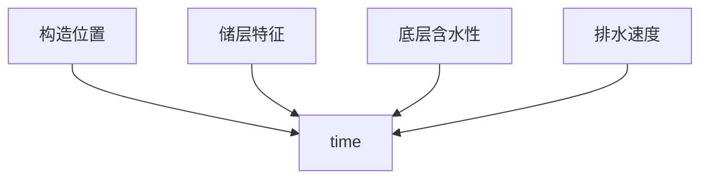
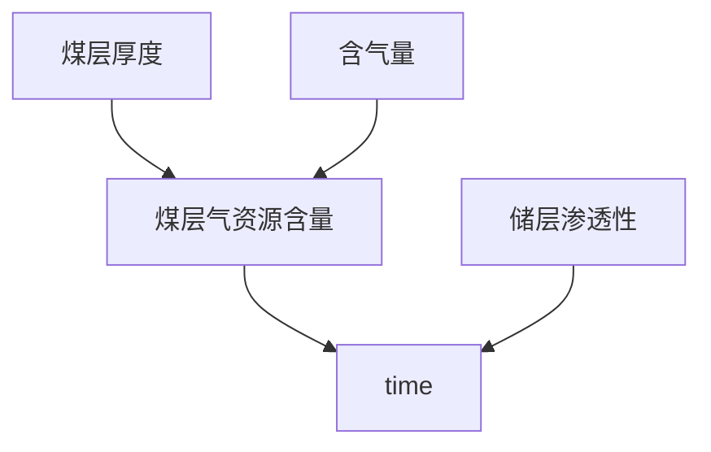
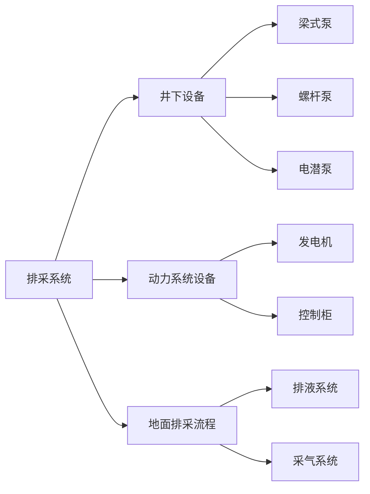
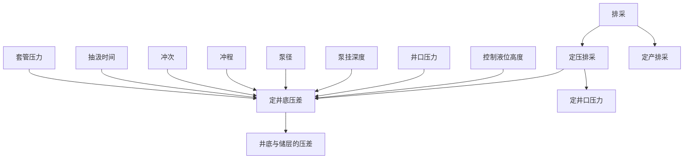
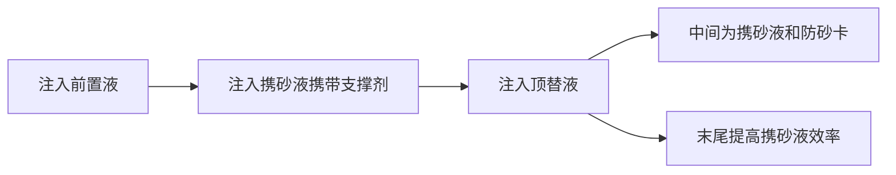

# 基于随机森林算法的煤层气直井产气量模型

煤层气产量评价和预测

随机森林算法具有计算量小，精确度高的优点，利用随机森林算法对历史产气量进行拟合分析

煤层气井产能因素：地质参数、工程措施、排采工艺参数

地质参数分为静态和动态，静态就是不会随着工程开采而产生变化的因素：煤层埋深、煤层厚度、地应力等
	动态因素：储层压力、渗透率等

排采工艺参数肯定基本上都是动态参数：井底流压、套压、动液面深度、冲次、冲程等
	流压>套压>动液面>冲次>冲程>埋深


是不是可以这样，首先图谱的基干是工程的操作流程以及地质的静态参数，对于工程的操作流程那一方面，在此期间每一个阶段会因为什么阶段而对什么动态因素产生影响，而这些因素最终都会对产气量产生影响

```python
工程 ——> 产气量 <—— 地质
```

（
1
）地质因素：主要包括煤储层厚度、渗透性、孔隙度、外生裂隙、割理、
微裂隙、粘土矿物含量、类型等储层特征；温度、压力、含气量、水动力条件、地
质构造、应力状态、煤层顶底板岩性、高度和厚度等储集状态；煤岩类型、煤体结
构、煤层厚度、显微组分组成、变质程度、灰分等煤岩特征。

（	
2
）钻完井因素：在钻井工程方面，煤层气井身结构、钻井液性能等影响着
煤层气的产能。煤层气直井、水平井产能不同，原因在于水平井泄流面积大，渗流
阻力小，相对于直井产能更大。水平井长度、分支井数量也与产能相关。本文研究
对象是直井和定向井，因此，对水平井不做过多研究。煤层气钻井液也影响着煤层
气产能，其他条件相同时，煤层气钻井液与储层相配伍，对储层伤害越小，产能越
高。钻井过程中应防止钻井压力产生压敏效应，从而制约煤层气井产能。为此，多
采用近平衡
/
欠平衡钻井。

煤层气井采用的完井方式（洞穴完井、裸眼完井、套管完井、射孔完井），射
孔完井深度、层位等对煤层气产能也有一定的影响。因此要采用合理的完井方式，
优化射孔工艺，增大煤层气产能。

（
3
）压裂因素：煤层气储层改造能改善原始储层物性和渗流特征，进而影响
煤层气开发效果，压裂技术是储层改造的主要手段，包括压裂工艺（压裂排量、压
裂泵压等）、压裂规模（携砂液量、加砂量、总液量、压裂砂比等）和压裂效果（裂
缝宽度、高度、压裂后渗透率、反排时间等）。

（
4
）排采因素：煤层气的排采制度影响着煤层气井产能。因此在排采过程中，
选择合理的排采设备，控制排采速度，优化合采层位，并防止出现排采伤害（压敏、
速敏、贾敏），实现精细化排采，最大化增加产能


```python
node_0 = Node('地质因素', name='地质因素')
node_1 = Node('钻完井因素', name='钻完井因素')
node_2 = Node('压裂因素', name='压裂因素')
node_3 = Node('排采因素', name='排采因素')
node_y = Node('产气量', name='产气量')

list_0 = ['煤储层厚度', '渗透率', '有效孔隙度', '开发层位', '储层温度', '储层压力', '含气量', '含气饱和度', '临界解吸压力',
          '灰分', '泥质含量', '粘土', '挥发分', '煤层埋深', '煤顶板高度', '破裂压力', '停泵压力', '最大镜质组反射率', '镜质组', '惰质组', '壳质组', '断层', '褶皱', '地应力']

list_1 = ['井型', '储层井径', '完钻进尺', '钻井液类型', '钻井液黏度', '建井周期', '机械钻速', '钻压',
          '转速', '水泥浆密度', '替浆量', '水泥浆用量']

list_2 = ['前置液量', '携砂液量', '顶替液量', '加砂量', '平均砂比', '压裂液总用量', '压裂泵压', '油压',
          '排量', '射孔厚度', '射孔孔数']

list_3 = ['泵深', '初始井底流压', '初始动液面', '见气时间', '见气动液面', '见气套压', '见气井底流压', '见气累排水量',
          '降液幅度', '排水速度', '平均排量']

def createNode(list_x):
    num = 0
    for name in list_x:
        node = Node(name, name=name)
        g.create(node)
        if list_x == list_0:
            createRelationships(node, '属于', node_0)
        if list_x == list_1:
            createRelationships(node, '属于', node_1)
        if list_x == list_2:
            createRelationships(node, '属于', node_2)
        if list_x == list_3:
            createRelationships(node, '属于', node_3)
        num += 1
        print('完成{}次'.format(num))


def createRelationships(node1, label, node2):
    rel = Relationship(node1, label, node2)
    g.create(rel)


createNode(list_0)
createNode(list_1)
createNode(list_2)
createNode(list_3)
createRelationships(node_0, '影响', node_y)
createRelationships(node_1, '影响', node_y)
createRelationships(node_2, '影响', node_y)
createRelationships(node_3, '影响', node_y)	
```

# 排采

排采工艺可以分为三个阶段：

## 排水降压阶段：

产水、当压力下降到解吸压力以下，气体开始解吸，并从井口开始产出，这个时间有很多因素影响



## 中期稳定生产阶段：

排水的继续，产气量逐渐上升并趋于稳定，出现高峰产气，产水量反而下降



## 后期产量下降阶段：

煤基质中解吸的气体开始逐渐减少，排水作业继续，产气量下降，产出少量或微量水





主要是**泵径的选择**、**生产压差的选择**、**套压的控制**、**下泵深度的选择**

# 压裂

注入的是**压裂液**和**携砂液**

压裂方案设计：


施工过程：



主要关注 **排量** **压力** **砂密度**


