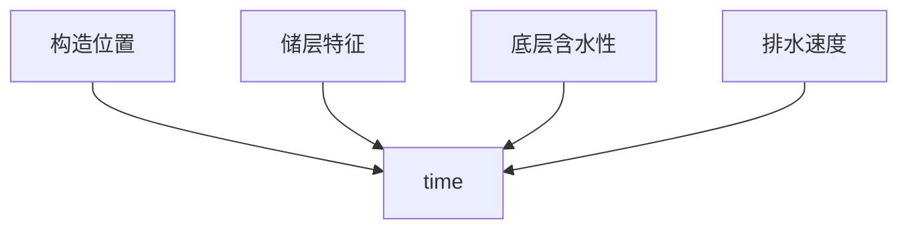
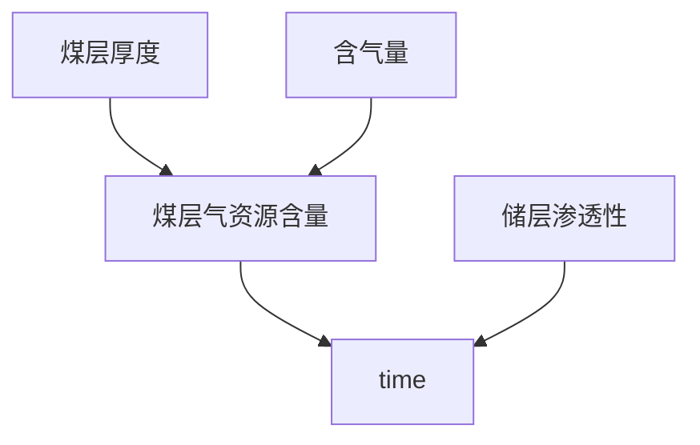
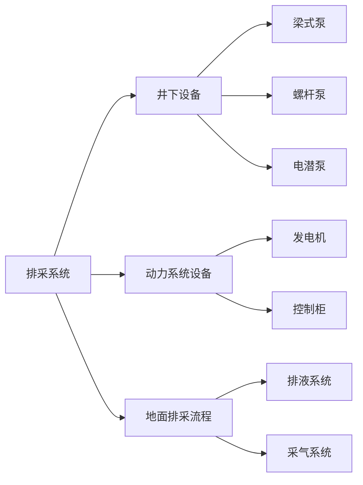
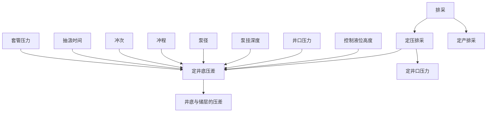
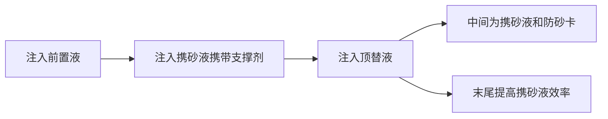

# 基于随机森林算法的煤层气直井产气量模型

煤层气产量评价和预测

随机森林算法具有计算量小，精确度高的优点，利用随机森林算法对历史产气量进行拟合分析

煤层气井产能因素：地质参数、工程措施、排采工艺参数

地质参数分为静态和动态，静态就是不会随着工程开采而产生变化的因素：煤层埋深、煤层厚度、地应力等
	动态因素：储层压力、渗透率等

排采工艺参数肯定基本上都是动态参数：井底流压、套压、动液面深度、冲次、冲程等
	流压>套压>动液面>冲次>冲程>埋深


是不是可以这样，首先图谱的基干是工程的操作流程以及地质的静态参数，对于工程的操作流程那一方面，在此期间每一个阶段会因为什么阶段而对什么动态因素产生影响，而这些因素最终都会对产气量产生影响

```python
工程 ——> 产气量 <—— 地质
```

（
1
）地质因素：主要包括煤储层厚度、渗透性、孔隙度、外生裂隙、割理、
微裂隙、粘土矿物含量、类型等储层特征；温度、压力、含气量、水动力条件、地
质构造、应力状态、煤层顶底板岩性、高度和厚度等储集状态；煤岩类型、煤体结
构、煤层厚度、显微组分组成、变质程度、灰分等煤岩特征。

（	
2
）钻完井因素：在钻井工程方面，煤层气井身结构、钻井液性能等影响着
煤层气的产能。煤层气直井、水平井产能不同，原因在于水平井泄流面积大，渗流
阻力小，相对于直井产能更大。水平井长度、分支井数量也与产能相关。本文研究
对象是直井和定向井，因此，对水平井不做过多研究。煤层气钻井液也影响着煤层
气产能，其他条件相同时，煤层气钻井液与储层相配伍，对储层伤害越小，产能越
高。钻井过程中应防止钻井压力产生压敏效应，从而制约煤层气井产能。为此，多
采用近平衡
/
欠平衡钻井。

煤层气井采用的完井方式（洞穴完井、裸眼完井、套管完井、射孔完井），射
孔完井深度、层位等对煤层气产能也有一定的影响。因此要采用合理的完井方式，
优化射孔工艺，增大煤层气产能。

（
3
）压裂因素：煤层气储层改造能改善原始储层物性和渗流特征，进而影响
煤层气开发效果，压裂技术是储层改造的主要手段，包括压裂工艺（压裂排量、压
裂泵压等）、压裂规模（携砂液量、加砂量、总液量、压裂砂比等）和压裂效果（裂
缝宽度、高度、压裂后渗透率、反排时间等）。

（
4
）排采因素：煤层气的排采制度影响着煤层气井产能。因此在排采过程中，
选择合理的排采设备，控制排采速度，优化合采层位，并防止出现排采伤害（压敏、
速敏、贾敏），实现精细化排采，最大化增加产能

```python
node_0 = Node('地质因素', name='地质因素')
node_1 = Node('钻完井因素', name='钻完井因素')
node_2 = Node('压裂因素', name='压裂因素')
node_3 = Node('排采因素', name='排采因素')
node_y = Node('产气量', name='产气量')

list_0 = ['煤储层厚度', '渗透率', '有效孔隙度', '开发层位', '储层温度', '储层压力', '含气量', '含气饱和度', '临界解吸压力',
          '灰分', '泥质含量', '粘土', '挥发分', '煤层埋深', '煤顶板高度', '破裂压力', '停泵压力', '最大镜质组反射率', '镜质组', '惰质组', '壳质组', '断层', '褶皱', '地应力']

list_1 = ['井型', '储层井径', '完钻进尺', '钻井液类型', '钻井液黏度', '建井周期', '机械钻速', '钻压',
          '转速', '水泥浆密度', '替浆量', '水泥浆用量']

list_2 = ['前置液量', '携砂液量', '顶替液量', '加砂量', '平均砂比', '压裂液总用量', '压裂泵压', '油压',
          '排量', '射孔厚度', '射孔孔数']

list_3 = ['泵深', '初始井底流压', '初始动液面', '见气时间', '见气动液面', '见气套压', '见气井底流压', '见气累排水量',
          '降液幅度', '排水速度', '平均排量']

def createNode(list_x):
    num = 0
    for name in list_x:
        node = Node(name, name=name)
        g.create(node)
        if list_x == list_0:
            createRelationships(node, '属于', node_0)
        if list_x == list_1:
            createRelationships(node, '属于', node_1)
        if list_x == list_2:
            createRelationships(node, '属于', node_2)
        if list_x == list_3:
            createRelationships(node, '属于', node_3)
        num += 1
        print('完成{}次'.format(num))


def createRelationships(node1, label, node2):
    rel = Relationship(node1, label, node2)
    g.create(rel)


createNode(list_0)
createNode(list_1)
createNode(list_2)
createNode(list_3)
createRelationships(node_0, '影响', node_y)
createRelationships(node_1, '影响', node_y)
createRelationships(node_2, '影响', node_y)
createRelationships(node_3, '影响', node_y)	
```

# 排采

排采工艺可以分为三个阶段：

## 排水降压阶段：

产水、当压力下降到解吸压力以下，气体开始解吸，并从井口开始产出，这个时间有很多因素影响



## 中期稳定生产阶段：

排水的继续，产气量逐渐上升并趋于稳定，出现高峰产气，产水量反而下降



## 后期产量下降阶段：

煤基质中解吸的气体开始逐渐减少，排水作业继续，产气量下降，产出少量或微量水





主要是**泵径的选择**、**生产压差的选择**、**套压的控制**、**下泵深度的选择**

# 压裂

注入的是**压裂液**和**携砂液**

压裂方案设计：


施工过程：



主要关注 **排量** **压力** **砂密度**

# 数据来源

- **试井报告**

  完井方法、储层压力、渗透率、储层温度、煤层有效厚度、孔隙度、流体密度、井筒半径、关井瞬时压力、煤埋深、闭合压力、破裂压力、封隔器

- **含气量报告**

  水分，灰分，挥发分，最大镜质体反射率

- **完井资料完井报告**

  钻头，钻井液，产层套管试压，割理情况

- **完井原始资料观察记录**

  钻压，泵压，转盘转数

- **排采数据**

  煤层顶深，泵径，冲次，套压，井底压力，动液面高度，日产水量，累计产水量，累计产气量，泵效

- **压裂施工工艺设计**

  完钻井深，生产层位，生产井段，煤厚度，水泥返深，水泥浆密度

- **压裂施工设计**

  有效孔隙度，吨煤含气量，射孔厚度，射孔数，射孔密度，压裂液类型，支撑剂类型，加砂强度

- **刘小磊，20151016，趋势细分**

  地层压力，解吸压力，计算含气量，降液速度，排采天数

- **刘小磊，20151016，郑庄区块储层压力**

  煤顶深度，静液面高度，地层压力，解吸时液面高度，解吸时套压，解吸时累计产水，解吸压力

- **刘小磊，20151019，含气饱和度**

  含气饱和度

- **刘小磊，20151020，含砂比例统计**

  煤层厚度，挥发分，灰分，粘土，泥质含量，渗透率，孔隙度，含气饱和度，顶板砂岩厚度，顶板计算泊松比，顶板计算弹性模量，底板砂岩厚度，底板计算泊松比，底板计算弹性模量，底板砂岩含砂比例

- **张志军，10.14，樊庄区块微观尺度研究**

  总压裂液量，加砂量，停泵压力，储层压力，解吸压力，地层水进入微观裂隙的尺度，累计产水量

- **张志军，10.15，数据统计**

  完钻深度，夹矸上碎裂煤厚度，夹矸碎粒及糜棱煤厚度，夹矸下原生煤厚度，夹矸下碎裂煤厚度，夹矸下碎粒及糜棱煤厚度


# 代码

```python
from py2neo import Graph, Node, Relationship, NodeMatcher
g = Graph('http://localhost:7474',user='neo4j',password='123456')

node_0 = Node('地质因素', name='地质因素')
node_1 = Node('钻完井因素', name='钻完井因素')
node_2 = Node('压裂因素', name='压裂因素')
node_3 = Node('排采因素', name='排采因素')
node_y = Node('产气量', name='产气量')

list_0 = ['煤储层厚度', '渗透率', '生产层位', '生产井段', '有效孔隙度', '储层温度', '含气饱和度', '灰分', '水分', '泥质含量',
          '粘土', '挥发分', '煤层顶深', '破裂压力', '闭合压力', '原始储层压力', '临界解吸压力', '最大镜质组反射率','吨煤含气量',
          '顶板砂岩厚度', '顶板泊松比', '顶板杨氏模量', '底板砂岩厚度', '底板泊松比','底板杨氏模量', '底板砂岩含砂比例', '割理']

list_1 = ['井型', '储层井径', '完钻井深', '钻井液类型', '钻井液黏度', '钻压', '水泥浆密度', '水泥返深', '  完井方法', '水泥浆用量']

list_2 = ['前置液量', '携砂液量', '顶替液量', '加砂量', '平均砂比', '压裂液总用量', '压裂泵压', '油压', '支撑剂粒径', '支撑剂类型'
          '排量', '射孔厚度', '射孔孔数', '射孔密度']

list_3 = ['初始井底流压', '静动液面高度', '冲次', '解吸动液面高度', '解吸套压', '解吸井底压力', '动液面下降速度', '平均排量',
          '泵效', '泵径', '平均日产水量', '解吸累计产水量', '停泵压力']


class Lone:
    def __init__(self, label):
        self.label = label
        self.node = None

    def judge(self, name, node):
        if name == self.label:
            self.node = node
            return self.node


def createNode(list_x):
    num = 0
    node1 = node2 = node3 = node4 = node5 = node6 = None
    for name in list_x:
        node = Node(name, name=name)
        g.create(node)
        # 单独的节点关系
        if node1 == None:
            node1 = Lone('煤储层厚度').judge(name, node)
        if node2 == None:
            node2 = Lone('原始储层压力').judge(name, node)
        if node3 == None:
            node3 = Lone('有效孔隙度').judge(name, node)
        if node4 == None:
            node4 = Lone('渗透率').judge(name, node)
        if node5 == None:
            node5 = Lone('煤层顶深').judge(name, node)
        if node6 == None:
            node6 = Lone('含气饱和度').judge(name, node)
        # 创建子关系的全部节点
        if list_x == list_0:
            createRelationships(node, '属于', node_0)
        if list_x == list_1:
            createRelationships(node, '属于', node_1)
        if list_x == list_2:
            createRelationships(node, '属于', node_2)
        if list_x == list_3:
            createRelationships(node, '属于', node_3)
        num += 1
    # 创建单独的节点关系
    create_lonely_node(node1, node2)
    create_lonely_node(node2, node3)
    create_lonely_node(node3, node4)
    create_lonely_node(node5, node4)
    create_lonely_node(node6, node2)
    print('完成{}次'.format(num))


def createRelationships(node1, label, node2):
    rel = Relationship(node1, label, node2)
    g.create(rel)


def create_lonely_node(node1, node2):
    if node1 != None and node2 != None:
        createRelationships(node1, '影响', node2)


createNode(list_0)
createNode(list_1)
createNode(list_2)
createNode(list_3)
createRelationships(node_0, '影响', node_y)
createRelationships(node_1, '影响', node_y)
createRelationships(node_2, '影响', node_y)
createRelationships(node_3, '影响', node_y)
```

# 别人的论文

基于机器学习方法研究煤层气单井产量主控因素及产量预测 -李亚林

**地质、钻完井、压裂、排采**方面来获取与稳定日产气量的关系

张建博等（2000）：煤层厚度、含气程度、解吸条件、渗透率、水文地质条件及工艺技术条件

孙茂远等人：煤厚，煤阶，含气量，地应力，储层压力，水动力条件，渗透率，压裂效果，气井施工质量

傅雪海等：煤储层的相对渗透率，井底压力

吕玉民：利用灰色关联分析法，埋深，煤厚，含气量，孔隙度，渗透率，压裂效果

王向浩：运用数值模拟，对比分析法

闫泊计：认为低密度和低粘度的钻井液密度会增大煤储层渗透性，对煤储层伤害程度较小

康园园等：射孔厚度，射孔层数，排采技术，增产措施

黄勇：固井质量的优劣，影响井的封闭效果

刘世奇：钻井液粘度，钻井液密度，水泥浆密度，水泥浆用量，顶替液用量都会对煤储层进行污染

司淑平：原始地层压力，压裂效果（压裂液中所含的聚合物，表面活性剂，杀菌剂，减阻剂等对煤层渗透率的严重伤害），气井后期维护过程中对煤层的污染（冲砂，洗井液中固相颗粒对孔隙的填充，作业时压力激动对煤层结构的破坏，化学反应造成孔隙的堵塞）

李金海：排采的速率

刘会虎：前置液量，前置液排量，前置液砂比，注砂量，平均砂比，破裂压力，停泵压力，前置液注入压力，携砂液注入压力，携砂液量，携砂液排量，携砂液砂比，顶替液注入压力，顶替液量，顶替液砂比

张艳玉：套压，管压，井底流压，动液面，累计产气量，累计产水量，日产水量作为回归变量，基于多元逐步回归方法，建立了预测模型

李宇等：灰色关联法，熵权法，属性层次分析法——求取影响因素的组合权重，认为渗透率，临储比是主控因素，地质因素对产量的影响要高于工程因素

杨显成：

陈振宏：原始地层压力，临界解吸压力（理论上，临界解吸压力和原始地层压力越接近，越容易解吸出煤层气），与断层的位置，日产水量和煤层海拔有关系，压裂液类型，加砂量（会影响到缝长，缝宽，能释放更大范围的应力，增加煤层气井的降压范围），**压裂液反排**，动液面下降速度会影响套管压力，临界解吸压力会影响地层产水量

**对原始数据进行预处理**

定性变量虚拟化处理，插补缺失值，相关分析，数据标准化和数据降维操作——提炼出**主成分因子**

**K均值据类，KNN分类算法**——主控因素诊断模型
	KNN：K-近邻算法

**RPROP神经网络模型，支持向量机模型和多元逐步回归方法**——稳产气量预测模型

对比分析三种方法的优略，找出最优的模型

|    模型    |   任务   |
| :--------: | :------: |
|   最近邻   |   分类   |
| 朴素贝叶斯 |   分类   |
|   决策树   |   分类   |
|   分类树   |   分类   |
|  线性回归  | 数值预测 |
|   回归树   | 数值预测 |
|   模型树   | 数值预测 |
|  神经网络  | 双重用处 |
| 支持向量机 | 双重用处 |
|  关联规则  | 模式识别 |
| K均值聚类  |   聚类   |

诊断因素对于煤层气井的影响而造成的后果，分成了好几类，所以相当于**分类任务**或者是**聚类任务**

在不同后果中，也就是分为的不同类型的井中，因素都相差较大

**求取权重方法的不足**

层次分析法：需要求取特征向量并进行一致性检验，需要专家对影响因素的重要程度进行主观的打分

灰色关联法：需要大量的数据作为支撑

数值模拟：人为作了很多的假设，主观程度较高

模糊综合分析：隶属度函数等求取困难

**灰色关联法：**

- 通过各因素的变化对因变量的影响程度进行分析
- 某一因素的改变导致因变量发生明显的变化，则认为此因素与因变量的关联度大

**属性层次分析法：**

- 首先对各因素的重要程度进行主观判断，确定标度矩阵，重要程度分为1，3，5，7，9，1/3，1/5，1/7，1/9
- 对于专家的意见，可以采取不同的专家意见求取平均值再放入求取权重

**熵权法：**

- 由各项指标观测值提供信息量来确定权重的方法
- 若指标的信息熵越小，该指标提供的信息量就越大，在评价中起到的作用就越大，权重越高
- 首先对数据进行无量纲化处理
- 计算指标值比重
- 计算熵值，获取差异系数，根据差异系数计算权重

# 代码Demo

```python
from py2neo import Graph, Node, Relationship, NodeMatcher
g = Graph('http://localhost:7474',user='neo4j',password='123456')
matcher = NodeMatcher(g)


# 验证节点是否创建成功
def matchNode(label, name):
    if matcher.match(label, name=name).first() is None:
        node = Node(label, name=name)
        g.create(node)


matchNode('地质因素', '地质因素')
matchNode('钻完井因素', '钻完井因素')
matchNode('压裂因素', '压裂因素')
matchNode('排采因素', '排采因素')
matchNode('产气量', '产气量')

list_0 = ['煤储层厚度', '渗透率', '生产层位', '有效孔隙度', '储层温度', '含气饱和度', '灰分', '水分', '泥质含量', '煤层海拔',
          '粘土', '挥发分', '煤层顶深', '破裂压力', '闭合压力', '原始储层压力', '临界解吸压力', '最大镜质组反射率', '吨煤含气量',
          '顶板砂岩厚度', '底板砂岩厚度', '底板砂岩含砂比例', '割理', '煤级', '兰氏体积', '兰氏压力', '镜质组', '惰质组', '壳质组']
# 镜质组，惰质组，壳质组可以确定煤岩类型

list_1 = ['井型', '储层井径', '完钻井深', '钻井液类型', '钻井液密度', '钻井液黏度', '钻压', '水泥浆密度', '完井方法', '水泥浆用量']
# 完井方法有：洞穴完井，裸眼完井，套管完井，射孔完井

list_2 = ['前置液量', '携砂液量', '顶替液量', '加砂量', '平均砂比', '压裂液总用量', '压裂泵压', '支撑剂粒径', '支撑剂类型'
          '排量', '射孔厚度', '射孔孔数', '射孔密度']
# 压裂效果：裂缝宽度，裂缝高度，压裂后渗透率，反排时间
# 加砂量：会影响缝宽，缝长，能释放更大范围的应力，增加煤层气井的降压范围，加砂量的使用会影响压裂液的用量
# 前置液，携砂液，顶替液都要随着时间发生变化，可能得需要分开来描述

list_3 = ['初始井底流压', '静动液面高度', '冲次', '解吸动液面高度', '解吸套压', '解吸井底压力', '动液面下降速度', '平均排量',
          '泵效', '泵径', '平均日产水量', '解吸累计产水量', '停泵压力']

list_xx = []
list_xx.extend(list_0)
list_xx.extend(list_1)
list_xx.extend(list_2)
list_xx.extend(list_3)

for i in list_xx:
    matchNode('影响因素', i)


'''
找出需要边的节点，如果不存在就创建新的，存在就创建关系
'''
def createRel(name1, name2):
    node_x = matcher.match(name=name1).first()
    node_y = matcher.match(name=name2).first()
    matchNode('影响因素', name1)
    matchNode('影响因素', name2)
    if node_x is not None and node_y is not None:
        # 查看关系是否存在
        cmd = "MATCH a=()-[:%s]->( {name: '%s'}) RETURN a" % ('影响', 'cause')
        if len(g.run(cmd).data()) == 0:
            relatp = Relationship(node_x, '影响', node_y)
            g.create(relatp)


# 创建关系
createRel('镜质组', '渗透率')
```


